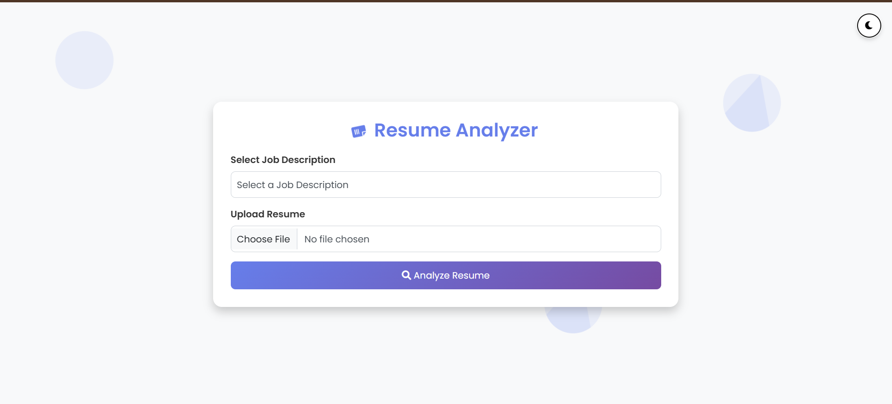
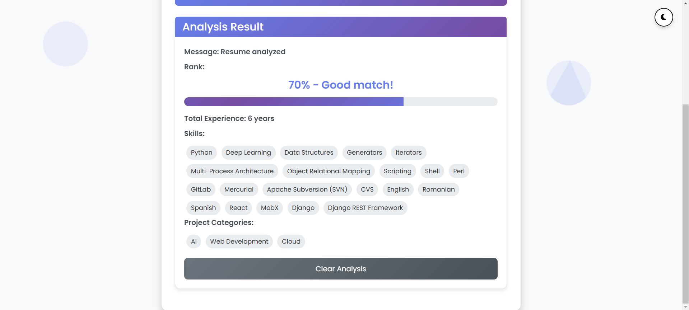
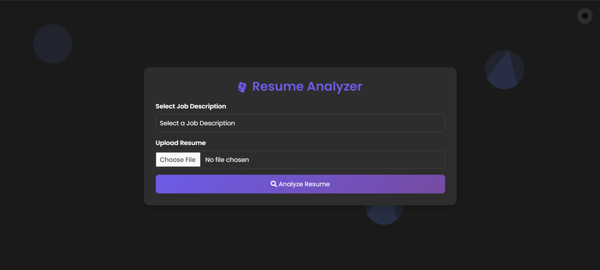
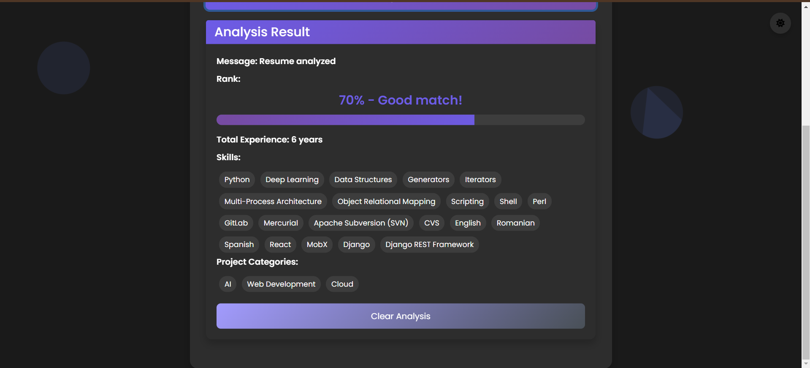

# Resume Analyzer

The **Resume Analyzer** is a web application designed to help job seekers analyze their resumes against specific job descriptions. It uses **AI-powered analysis** to extract key details such as skills, total experience, and project categories, and ranks the resume's relevance to the job description.

---

## Screenshots 📸

### 1. Home page

*The home page where users can select a job description and upload their resume.*

### 2. Analysis Results

*The analysis results displaying rank, skills, experience, and project categories.*

### 3. Dark Mode


*The application in dark mode for better readability in low-light environments.*

---

## Video Demonstration 🎥

Watch a quick demo of the **Resume Analyzer** in action:


*Click above to watch the video.*

---

## Features ✨
- **Job Description Selection**: Choose from a list of predefined job descriptions.
- **Resume Upload**: Upload resumes in PDF or DOCX format.
- **AI-Powered Analysis**: Utilizes the **Groq API** with the **LLaMA 3.3 70B model** for accurate resume analysis.
- **Detailed Insights**:
  - **Rank**: Percentage match between the resume and job description.
  - **Skills**: Extracted skills from the resume.
  - **Total Experience**: Total years of experience calculated from the resume.
  - **Project Categories**: Categorization of projects mentioned in the resume.
- **User-Friendly Interface**: Clean and intuitive UI built with **Bootstrap** and **JavaScript**.

---

## Technologies Used 🛠️
- **Backend**: Django, Django REST Framework
- **Frontend**: HTML, CSS, Bootstrap, JavaScript
- **AI Integration**: Groq API with LLaMA 3.3 70B model
- **Libraries**:
  - `pdfplumber`: For extracting text from PDF files.
  - `spacy`: For natural language processing (NLP) tasks.

---

## Setup Instructions 🚀

### Prerequisites
- Python 3.8 or higher
- Django 4.0 or higher
- Groq API key (sign up at [Groq](https://groq.com/))

### Installation Steps
#### Create a virtual environment:
```bash
python -m venv venv
source venv/bin/activate  # On Windows: venv\Scripts\activate
```

#### Install dependencies:
```bash
pip install -r requirements.txt
```

#### Set up environment variables:
Create a `.env` file in the root directory and add your Groq API key:
```ini
GROQ_API_KEY=your_groq_api_key_here
```

#### Run migrations:
```bash
python manage.py migrate
```

#### Start the development server:
```bash
python manage.py runserver
```

#### Access the application:
Open your browser and navigate to `http://127.0.0.1:8000/`.

---

## Usage 📋
### 1. Select a Job Description:
Choose a job description from the dropdown menu.

### 2. Upload a Resume:
Upload your resume in PDF or DOCX format.

### 3. Analyze:
Click the **"Analyze Resume"** button to start the analysis.

### 4. View Results:
The results will display:
- **Rank**: Percentage match between the resume and job description.
- **Skills**: Extracted skills from the resume.
- **Total Experience**: Total years of experience.
- **Project Categories**: Categorization of projects.

---

## API Endpoints 🌐
### Fetch Job Descriptions:
```bash
GET /api/jobs/
```
Returns a list of all job descriptions.

### Analyze Resume:
```bash
POST /api/resume/
```
Analyzes a resume against a job description.

---

## Contributing 🤝
Contributions are welcome! If you'd like to contribute, please follow these steps:

1. **Fork the repository.**
2. **Create a new branch**:
   ```bash
   git checkout -b feature/your-feature
   ```
3. **Commit your changes**:
   ```bash
   git commit -m 'Add some feature'
   ```
4. **Push to the branch**:
   ```bash
   git push origin feature/your-feature
   ```
5. **Open a pull request.**

---

## Acknowledgments 🙏
- **Groq** for providing the LLM API.
- **Django and Django REST Framework** for backend development.
- **Bootstrap** for frontend styling.
- **LLaMA 3.3 70B** for AI-powered analysis.

---

## How to Add Screenshots and Video

### **Screenshots**:
- Add your screenshots to the `screenshots/` directory.
- Update the `README.md` file with the correct paths to your screenshots.

### **Video Demonstration**:
- Upload your demo video to YouTube or any other video hosting platform.
- Replace `your-video-id` in the video link with your actual video ID.
- Add a thumbnail image for the video in the `screenshots/` directory and update the path in the `README.md` file.

---

### **How to Use**
1. Copy the entire content above.
2. Paste it into a new file named `README.md` in the root directory of your project.
3. Replace placeholders like `your-video-id` and `your_groq_api_key_here` with your actual video ID and Groq API key.
4. Add your screenshots to the `screenshots/` directory and update the paths in the `README.md` file.

This `README.md` file is now ready to be used in your GitHub repository! Let me know if you need further tweaks. 😊
